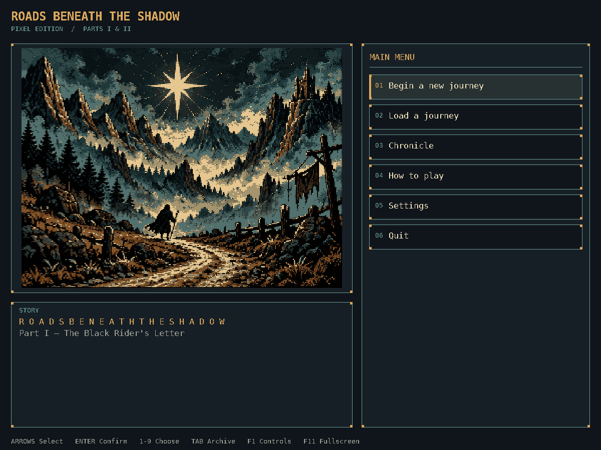
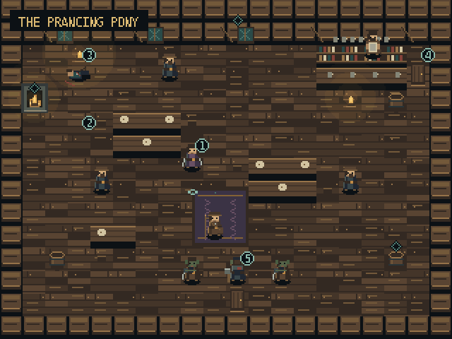
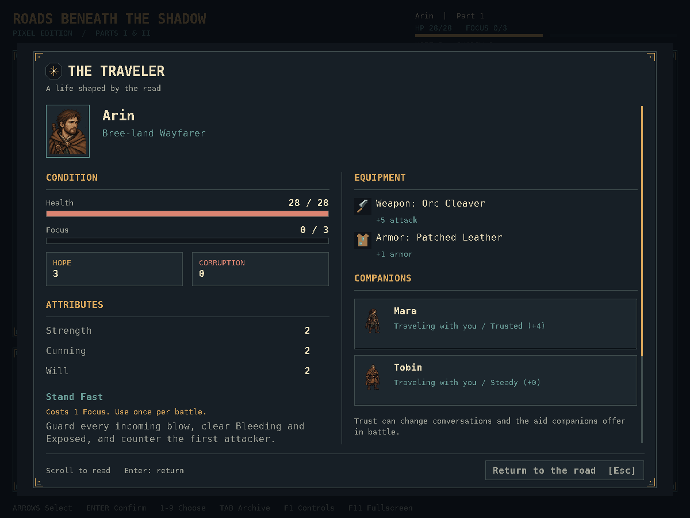
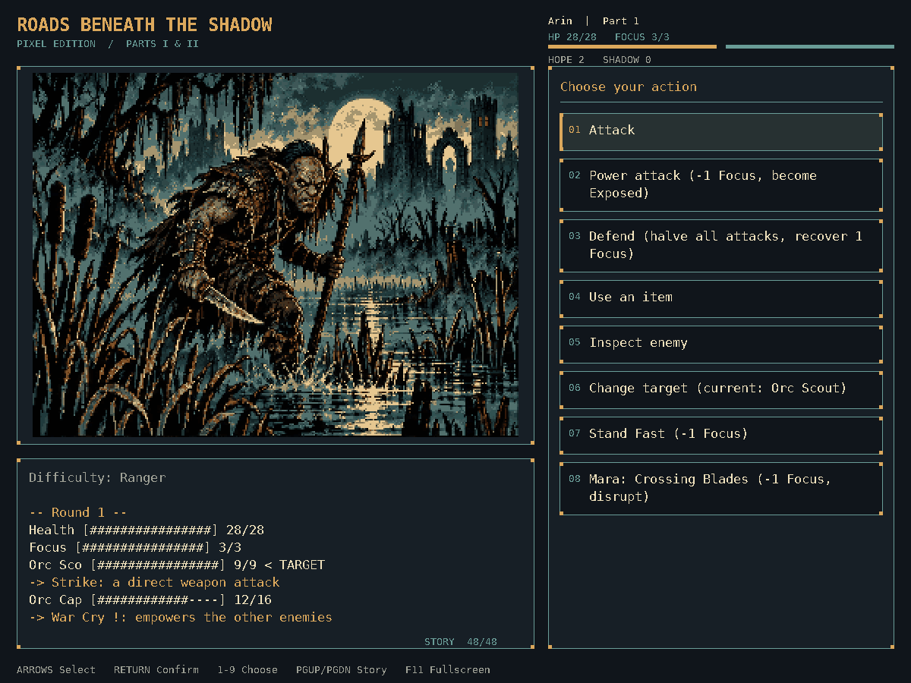

# The Lord of the Rings: Roads Beneath the Shadow

> A pixel-art, choice-driven dark fantasy RPG where trust, clues, and corruption reshape the road ahead.

[](https://www.python.org/downloads/)
[](#play-the-pixel-art-edition)
[](https://github.com/makaboi/roads-beneath-the-shadow/actions/workflows/quality.yml)
[](https://github.com/makaboi/roads-beneath-the-shadow/stargazers)

**Version 0.7.2 makes the road clearer to play.** Play with a mapped gamepad, name your traveler with the on-screen keyboard, and preview damage before committing a combat action. Bundled fallback fonts make CJK and Devanagari names readable, and selected panel details have stronger contrast. Exploration highlights the choice you are browsing and marks details you have inspected. Save cards show your traveler's portrait and progress; multi-question scenes remember your submitted answers when you return. Drawing pauses while the window is minimized and resumes at the same page or combat moment.

*Roads Beneath the Shadow* is a story-driven RPG set in Middle-earth during the War of the Ring. You play an unknown traveler whose guardian has vanished and whose quiet life ends when a dying messenger delivers a broken silver star.

The game contains two complete playable episodes: **Part I — The Black Rider's Letter** and **Part II — The Dead Road**. Play at your own pace; the time you spend varies with reading speed, exploration, and combat choices.



## Play the pixel-art edition

### Download and play

[Download the latest release](https://github.com/makaboi/roads-beneath-the-shadow/releases/latest), extract the complete archive, and launch the game. **Python is not required.** Choose the download for your operating system and processor:

| Platform | Download | Launch after extracting |
| --- | --- | --- |
| macOS, Apple silicon | [macOS Apple silicon ZIP](https://github.com/makaboi/roads-beneath-the-shadow/releases/latest/download/Roads-Beneath-the-Shadow-macOS-Apple-Silicon.zip) | Double-click `Play Roads Beneath the Shadow.command` |
| macOS, Intel | [macOS Intel ZIP](https://github.com/makaboi/roads-beneath-the-shadow/releases/latest/download/Roads-Beneath-the-Shadow-macOS-Intel.zip) | Double-click `Play Roads Beneath the Shadow.command` |
| Windows 10/11, x64 | [Windows ZIP](https://github.com/makaboi/roads-beneath-the-shadow/releases/latest/download/Roads-Beneath-the-Shadow-Windows-x64.zip) | Double-click `Roads-Beneath-the-Shadow.exe` |
| Linux, x64 | [Linux TAR.GZ](https://github.com/makaboi/roads-beneath-the-shadow/releases/latest/download/Roads-Beneath-the-Shadow-Linux-x64.tar.gz) | Run `./Roads-Beneath-the-Shadow` from the extracted folder |

Each release includes a matching `.sha256` checksum for every archive and a `START-HERE.txt` guide. Keep the executable and its complete `_internal` folder together after extraction. A desktop display is required for pixel mode. The game runs offline, and the same executable accepts `--terminal` for terminal play.

### Run from source

Source installation requires **Python 3.10+** on macOS, Windows, or Linux. Install the game into a virtual environment:

```bash
git clone https://github.com/makaboi/roads-beneath-the-shadow.git
cd roads-beneath-the-shadow
python3 -m venv .venv
```

On macOS and Linux:

```bash
.venv/bin/python -m pip install .
.venv/bin/python -m roads_beneath_shadow
```

On Windows, use `py` in place of `python3` when creating the environment, then:

```powershell
.venv\Scripts\python.exe -m pip install .
.venv\Scripts\python.exe -m roads_beneath_shadow
```

The pixel edition uses **pygame-ce**. World maps, character animation, illustrations, DejaVu and Noto-derived fonts, and original audio are bundled locally; the game does not need an internet connection while playing. The macOS source launcher, `Play Roads Beneath the Shadow.command`, uses the local `.venv` when available.

### Explore the road

Thirteen walkable locations carry the journey through Bree and the Dead Road, including the north gate, Midgewater camp and watch-post, Echo Bridge, the Drowned Mile, and the prisoners' sluice. Use **WASD** to walk and **E** beside a character, clue, or doorway to interact. Click a marked place to walk there, then press E or click it again to interact. Nearby points show what they offer. The side menu offers the same story choices, so you can also click an option or use its number.

Thirty-five unnumbered diamond markers offer small details of these places. Approach one and press **E** to look closer; reading these descriptions is free and leaves your story choices open. Close a description with E, Enter, Escape, or its X button; the discovery remains searchable in Archive. Inspected details receive a check mark during the current visit. Browsing a story choice highlights its matching place on the map.

Continue illustrated story pages with **Space** or **Enter**. **F1** opens Controls while keeping your place. At a story choice, **Escape** or **P** opens Pause for saves, Settings, and Controls. Larger reading text and reduced motion are available there.

During battle, read each enemy's next intention before choosing a command. Click an enemy or use **[** and **]** to change targets; Inspect and changing targets spend no turn. Action details forecast direct damage against the selected target, including its defenses; counterattacks are marked conditional. Hovering these details keeps the command area stable for clicking. Health changes when the visible blow lands, and a short summary keeps your strike, healing, guard, and incoming damage clear. Enemy phase changes are announced. Survival encounters state how long you must hold out; the Black Rider is marked **Cannot be wounded** instead of showing an ordinary Health target.

Inventory, character, and journal panels keep equipment, relationships, quests, and clues close at hand. Companion cards distinguish traveling companions from those who returned above, left the company, or remained at a seal. Conversations and recovery choices update as you complete them; the Last Lantern offers only the companions who are actually present.

**Tab** opens the searchable story archive. It records the current session's narration, chosen answers, and inspected world details. **Ctrl+F** or **Command+F** searches the full record, including discoveries that have scrolled out of view. Starting or loading a journey begins a fresh transcript; **Continue** keeps your current record.

The game records a separate automatic checkpoint at safe story transitions. **Resume checkpoint** restores it from the main menu. Your three manual save slots remain available, and **F5** opens saving while exploring. A checkpoint returns to a story decision rather than a character's exact position in a room or an unfinished combat turn.



### Pixel controls

| Control | Action |
| --- | --- |
| W / A / S / D | Walk in exploration locations |
| E | Interact with a nearby character, clue, or doorway |
| Click a choice | Select a story, exploration, or combat action |
| Click a world marker | Walk to it; click again nearby or press E to interact |
| Click an enemy / [ / ] | Choose a combat target without spending a turn |
| Up / Down | Navigate menu choices |
| Return / Space | Reveal or advance the story; confirm a menu selection |
| Backspace | Return to the previous story page |
| 1–9 | Choose the corresponding option; use arrows or the mouse for longer menus |
| Tab | Open or close the story archive |
| Page Up / Page Down | Open and scroll the story archive |
| Ctrl+F / Command+F | Search the open story archive |
| Enter / Shift+Enter in search | Go to the next / previous match |
| F3 / Shift+F3 | Repeat the saved archive search forward / backward |
| Mouse wheel | Scroll menu choices or an open story archive |
| I / C / J | Inventory, character, and journal at story decisions |
| R | Open the road map at story decisions |
| F5 | Open save slots while exploring |
| M | Return to the main menu at story decisions |
| F1 | Open Controls without changing the current story choice |
| P / Escape at a story choice | Open Pause for saves, Settings, and Controls |
| F11 | Toggle fullscreen |
| Escape | Close a panel, end transcript search, or return from a menu with Back |

Enter your traveler's name with the keyboard or the **On-screen keyboard** button. Move the caret with Left/Right or Home/End, click to position it, and hold Shift to select text; Ctrl+A or Command+A selects the whole name. Physical typing supports Unicode text and input-method composition. Escape closes the on-screen keyboard first, then cancels name entry or background selection; **Choose again** returns from the confirmation screen to background selection. Resize the window to fit your display; reading and battle text also scale on larger displays. Every exploration choice remains available through the side menu, so walking is optional.

The bundled fonts cover the game's English text, common accented names, CJK characters, and Devanagari text. Name entry and archive search keep supported combining sequences together when scrolling. Names retain their original characters and the 24-character limit. The story is in English; this font coverage does not provide translations or a complete editor for every writing system.

### Gamepad controls

Connect a gamepad recognized by SDL's controller mappings. Button names below use the common Xbox layout; A/B/X/Y are the bottom/right/left/top face buttons.

| Control | Action |
| --- | --- |
| Left stick | Walk in exploration; navigate other menus |
| D-pad | Browse choices, panels, and the on-screen keyboard |
| A | Confirm, interact with the selected choice, or advance the story |
| B | Back or close; revisit the previous story page while reading |
| X | Inventory at story decisions; Inspect in combat; open the naming keyboard |
| Y | Journal at story decisions |
| Left / right bumper | Change combat target; scroll panels and Archive |
| View / Back | Open or close Archive |
| Menu / Start | Pause at a story decision; close an open panel |
| Left / right stick click | Road map / character panel at story decisions |

Release held controls after switching menus or reconnecting. Keyboard and mouse remain available alongside the gamepad; physical typing can enter characters outside the on-screen keyboard.

### Terminal and accessibility

The terminal edition still runs with only the Python standard library:

```bash
python3 -m roads_beneath_shadow --terminal
python3 -m roads_beneath_shadow --screen-reader
```

Screen-reader mode uses numbered terminal prompts, scene descriptions, full enemy names, and numeric Health and Focus. It omits decorative art and color escapes, even when Color is enabled. If this preference was saved, the next launch uses terminal mode; `--pixel` explicitly opens the graphical game. Terminal and screen-reader launches also offer automatic checkpoints and Resume checkpoint. Submitted answers in multi-question scenes survive manual saves and checkpoints while later questions remain open.

These options apply to either presentation:

```bash
.venv/bin/python -m roads_beneath_shadow --sound
.venv/bin/python -m roads_beneath_shadow --reduced-motion
.venv/bin/python -m roads_beneath_shadow --text-speed fast
.venv/bin/python -m roads_beneath_shadow --difficulty story
```

Set persistent preferences from **Settings**, including Standard, Large, or Larger graphical reading and battle text. Sound starts **off**; enable it there or with `--sound` for original ambience, music, and cues. Five subtle scores follow the tavern, northern road, buried halls, Last Lantern, and combat, with smooth transitions between them. Separate music and sound-effect volume controls also apply to story cues and battle reactions. Quiet footsteps follow the terrain; hits, guards, healing, and escapes have distinct cues, and important story cues briefly soften the music. Reduced motion quiets character and scene animation while keeping exploration controls available. Combat difficulty choices are **Story**, **Ranger**, and **Shadow**. In a server or CI environment without a desktop, use terminal mode or the headless screenshot command under Development.

## Current features

- Thirteen walkable pixel-art locations with collision, nearby prompts, thirty-five optional look spots, companion followers, and direct menu alternatives
- Directional and origin-specific character animation, origin portraits, and foliage and pillars that characters can walk behind
- Illustrated story pages with adjustable reading text, paragraph-aware pagination, preserved reveal and reading position during resizing, and a searchable archive of the current journey and its discoveries
- Animated tactical battles with visible Health impacts, enemy phase changes, concise turn summaries, intentions, status, selectable targets, and clear survival objectives
- Graphical inventory, character, journal, road map, Chronicle, and enemy inspection panels with readable equipment comparisons and companion whereabouts that follow earned story outcomes
- A separate automatic story checkpoint alongside three manual save slots, with atomic writes, portrait previews, remembered multi-question answers, and compatible existing saves
- Twenty-seven bundled scene and battle illustrations, thirteen world maps, dedicated battle and portrait sheets, shared exploration and depth atlases, and bundled fonts in a restrained dark fantasy palette
- Five original, seamless ambient scores, terrain footsteps, and battle and story cues, with shared mute/volume controls and graceful audio-device recovery
- Two complete episodes with branching routes, optional conversations, and consequences carried into their endings
- Editable Unicode character names, an on-screen naming keyboard, mapped gamepad controls, three distinct backgrounds, and a formative lesson from Calenor
- Five opening tactics that alter clues, trust, resources, and later options
- Substantive conversations with Mara and watchman Tobin Reed
- Rescue, testimony, and prisoner quests whose outcomes carry into later scenes and endings
- Eight encounter slots across both episodes: three in Part I, four mandatory in Part II, and an avoidable duel with Teren
- Telegraphed enemy intentions, target selection, interrupts, status effects, Focus, defense, armor, healing, and encounter objectives
- Reliable defense against multiple enemies: Defend halves incoming physical hits for the round and restores 1 Focus; companions can protect you during survival objectives
- Recovery after the opening fight keeps the journey moving, and inspecting or switching targets never repeats an enemy's Bleeding damage
- A distinct combat ability for each background, plus different tactical commands for Mara and Tobin
- Story, Ranger, and Shadow combat difficulty modes; Shadow rewards interrupts, defense, and companion tactics instead of damage-racing
- Persistent hope, corruption, clues, companion trust, and quest outcomes across both episodes; completed Part I saves can begin Part II directly from the ending screen
- Eight causally different endings across Parts I and II, each with an explicit recap of the choices that created it
- A persistent Traveler's Chronicle with episode-aware ending records and eleven achievements
- An optional Last Lantern scene before the Part II finale: hear Mara's hopes, share Tobin's watch, or speak to Calenor beyond his Warden duty; these conversations remember earlier choices and return in the ending recap
- Adjustable narration speed and reading text size, reduced motion, narrow-terminal handling, screen-reader scene descriptions, and in-game Controls
- Mouse choices, number keys, arrow navigation, resizing, and fullscreen in the pixel edition; W/S and numbered prompts in the terminal
- A Part I Black Rider cliffhanger, a complete Part II resolution, and a new road toward Part III: *The Waking City*
- Shared story and combat logic across the desktop and terminal presentations

Save files are stored in:

```text
~/Library/Application Support/Roads Beneath the Shadow/saves/
```

Set `RBS_SAVE_DIR` to use a different save location.

On Windows and Linux, the default save directory is `~/.roads_beneath_shadow/saves/`. Both presentations share the same save slots.

The automatic checkpoint is `checkpoint.json` inside the same save directory. Settings and Chronicle progress are stored beside the `saves` folder. Completed journeys have stable IDs, so reopening an ending save cannot duplicate its Chronicle credit.

Save cards show **Journey time**, which advances when story events resolve. This is the journey's scripted time; time spent reading, exploring, or leaving the game open does not increase it.





## Controls

The terminal edition uses numbered choices. Interactive menus also support W/S or arrow navigation and Return/D to confirm; screen-reader mode keeps numbered line prompts. At story decisions:

| Key | Action |
| --- | --- |
| Number, then Return | Choose a story option |
| `I` | Open inventory and equipment |
| `C` | Show character status |
| `J` | Read quests and clues |
| `R` | Show the road map |
| `P` | Open Pause for saves, Settings, and Controls |
| `H` | Read Controls |
| `S` | Save the journey |
| `M` | Return to the main menu |

## Development

Install the development dependencies and run the complete suite:

```bash
.venv/bin/python -m pip install '.[test]'
.venv/bin/python -m unittest discover -s tests -v
.venv/bin/python -m compileall -q roads_beneath_shadow
.venv/bin/python -m roads_beneath_shadow --check-install
.venv/bin/python -m roads_beneath_shadow --check-runtime-assets
.venv/bin/python scripts/check_installed_game.py --python .venv/bin/python
```

The graphical tests use dummy SDL drivers and do not open a window. To render a real title-screen screenshot without a desktop on macOS/Linux:

```bash
SDL_VIDEODRIVER=dummy SDL_AUDIODRIVER=dummy \
  .venv/bin/python -m roads_beneath_shadow --pixel --screenshot /tmp/pixel-title.png
```

On Windows, set `$env:SDL_VIDEODRIVER="dummy"` and `$env:SDL_AUDIODRIVER="dummy"` in PowerShell before the same command. Pixel scenes use nearest-neighbor scaling; the renderer keeps all graphics operations on the main thread while the story engine waits for choices in a worker.

The Quality Gate runs eight combinations of Python 3.10 and 3.13 on Linux, Windows, Apple-silicon macOS, and Intel macOS. It also verifies a regular installed wheel from outside the checkout, comparing every module and bundled resource with the source. The desktop workflow builds all four standalone downloads, checks their version, decodes every PNG, TTF, OTF, and WAV through the bundled SDL runtime, verifies font coverage fingerprints, renders a title screen, and exercises terminal input. It repeats those checks through the extracted player launcher from a folder containing spaces. All four archives and their SHA-256 checksums publish together only after the exact commit passes every Quality Gate job and GitHub's uploaded digests match. Pull requests build the same four native archives as preview artifacts without creating a tag or release. The workflow can also be started manually with `preview_only` enabled. On `main`, an unpublished project version can publish after the required checks; an existing published version is retained.

The code is split into portable systems:

- `pixel_ui.py` — desktop controls and the main-thread bridge to the story engine
- `pixel_world.py` / `world_atmosphere.py` / `pixel_assets/` — walkable maps, regional lighting and weather, collision, interaction points, and character animation
- `narrative.py` / `pixel_transcript.py` — illustrated story pages, source-anchored reading position, and searchable transcripts
- `pixel_theme.py` / `pixel_font.py` / `font_assets/` — bundled typography, measured script fallbacks, and cluster-preserving wrapping
- `controls.py` — shared in-game help
- `text_input.py` — Unicode caret editing shared by name entry and archive search
- `runtime_assets.py` — display-free native decoder verification for release candidates
- `pixel_battle.py` / `combat_view.py` — tactical battle presentation and immutable combat snapshots
- `pixel_panels.py` / `player_view.py` — inventory, character, and journal panels with immutable player snapshots
- `pixel_art.py` — story illustration selection
- `app.py` / `part_two.py` — story flow, consequences, and endings
- `story_choices.py` — live choices refreshed after Inventory or Settings
- `combat.py` / `models.py` — tactical combat and character state
- `savegame.py` / `checkpoint.py` / `profile.py` / `settings.py` — save slots, automatic checkpoints, Chronicle, and preferences
- `ui.py` — original terminal presentation and accessibility
- `artwork.py` / `journey_artwork.py` / `part_two_artwork.py` — original terminal art
- `audio.py` / `soundscapes.py` — optional original cues, ambience, and nonblocking music transitions
- `content.py` — items, backgrounds, and chapter content

Pixel artwork provenance is bundled in `pixel_assets/manifest.json`, including generated-source and native-image hashes, palette choices, and conversion details. `scripts/generate_pixel_assets.py` and `scripts/build_story_scene.py` convert the story illustrations; `scripts/build_origin_portraits.py`, `scripts/build_battle_cast.py`, `scripts/build_battle_enemies.py`, and `scripts/build_battle_locations.py` pack the generated portraits, actors, and battle floors. `scripts/generate_world_assets.py` rebuilds the authored world maps, walking animation, depth atlas, and small world portraits; `scripts/generate_soundscapes.py` reproduces the five original ambient WAVs using Python's standard library. Original terminal references remain in `assets/ascii-sources/`; `scripts/generate_marketing_assets.py` regenerates the terminal preview collection. Pillow is a development tool and is not needed to play. The unmodified DejaVu fonts retain their license in `font_assets/LICENSE.txt`; standalone archives also include `FONT-LICENSE.txt`. Desktop downloads retain third-party licenses, LGPL library source archives, and build provenance in `third-party/`, with a guide in `THIRD-PARTY-NOTICES.md` and file hashes in `THIRD-PARTY-INVENTORY.json`. Their pygame libraries remain separate files for compatible replacement; the game's copyright terms are unchanged.

The fallback fonts retain their copyrights and SIL Open Font License 1.1 in `font_assets/FALLBACK-OFL.txt` and the desktop download's `FONT-FALLBACK-LICENSE.txt`. `font_assets/fallback-coverage.json` records the original managed Noto binaries, exact extracted font hashes, and Unicode coverage. To reproduce the assets, install the development-only `fonttools==4.61.1` and run `tools/build_font_assets.py --cjk-source /path/to/NotoSansCJK-Regular.ttc --devanagari-source /path/to/NotoSansDevanagari-Regular.ttf --output-directory /path/to/output`. The builder requires the documented source hashes and renames the extracted CJK derivative. FontTools and the original collection are not needed to play.

## Roadmap

1. Part III — The Waking City
2. More walkable locations, companion relationship routes, and camp scenes
3. More equipment sets, rare conditions, and enemy archetypes
4. Optional signed macOS application bundle

## Support the journey

- [Star the repository](https://github.com/makaboi/roads-beneath-the-shadow) if you want the road to continue into Part III.
- [Report a bug](https://github.com/makaboi/roads-beneath-the-shadow/issues) if something interrupts your adventure.
- Share your background, major choices, and ending without spoiling the path for new players.

This is an unofficial fan project. Middle-earth and *The Lord of the Rings* are the property of their respective rights holders.
