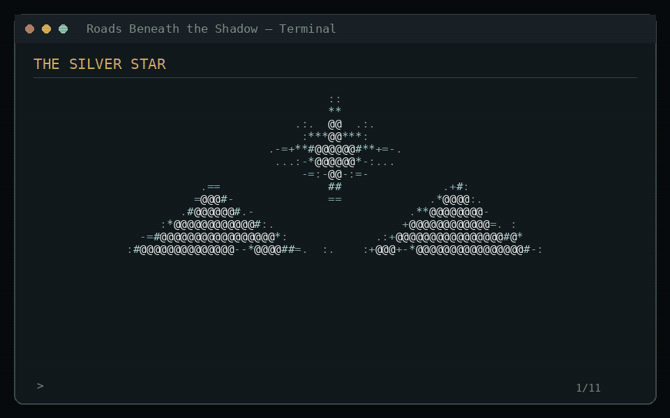

# The Lord of the Rings: Roads Beneath the Shadow

> A retro, choice-driven terminal RPG where trust, clues, and corruption reshape the road ahead.

[](https://www.python.org/downloads/)
[](#quick-start-on-macos)
[](https://github.com/makaboi/roads-beneath-the-shadow/actions/workflows/quality.yml)
[](https://github.com/makaboi/roads-beneath-the-shadow/stargazers)

**[Download the latest macOS release](https://github.com/makaboi/roads-beneath-the-shadow/releases/latest)** — no installation and no Python required for the standalone build.

**Release packaging note:** the existing standalone macOS downloads contain Part I. Parts I and II are playable from source now; standalone Part II binaries have not been released yet.

*Roads Beneath the Shadow* is a story-driven terminal RPG set in Middle-earth during the War of the Ring. You play an unknown traveler whose guardian has vanished and whose quiet life ends when a dying messenger delivers a broken silver star.

The source edition contains two complete playable episodes: **Part I — The Black Rider's Letter** and **Part II — The Dead Road**. Part I is roughly 45–70 minutes; Part II is roughly 110–130 minutes for a normal first playthrough, depending on reading speed, exploration, and combat choices.

```text
                         |
                     \   |   /
                      \  |  /
                  ------ * ------
                      /  |             \
             /\          |          /\
        ____/  \____            ___/  \____
     __/      /\    \__________/   /\      \__
 ___/________/__\_________________/__\_________\___
                        /  \
_______________________/____\_______________________

          R O A D S   B E N E A T H
               T H E   S H A D O W
```

**Play it, shape a different path, and compare your ending.** If you enjoy the journey, starring the repository helps other terminal-game and interactive-fiction players discover it.



## Quick start on macOS

### Easiest method: standalone download

The current standalone packages contain Part I. To continue through Part II now, use the source edition below.

1. Open the [latest release](https://github.com/makaboi/roads-beneath-the-shadow/releases/latest).
2. Under **Assets**, download `Roads-Beneath-the-Shadow-macOS-Apple-Silicon.zip` for an M-series Mac or `Roads-Beneath-the-Shadow-macOS-Intel.zip` for an Intel Mac.
3. Open the downloaded ZIP file to create the `Roads-Beneath-the-Shadow` folder.
4. Open that folder and double-click:

```text
Play Roads Beneath the Shadow.command
```

A Terminal window opens directly at the title screen. The standalone edition includes everything it needs.

This independent build is not yet signed or notarized with an Apple Developer ID. If macOS blocks it, first try to open it once, then go to **System Settings > Privacy & Security**, scroll to **Security**, choose **Open Anyway**, and confirm **Open**. Only override this protection when you downloaded the file from this repository. See [Apple's current guidance](https://support.apple.com/102445).

To launch the standalone executable from Terminal instead of double-clicking, enter `./Roads-Beneath-the-Shadow` inside its folder.

### Run the source edition instead

The source edition includes Parts I and II. It requires macOS and Python 3.10 or newer, but no third-party packages. Check Python with `python3 --version`. Download it through **Code > Download ZIP** on the repository page, open the ZIP, then enter:

```bash
cd ~/Downloads/roads-beneath-the-shadow-main
python3 -m roads_beneath_shadow
```

If you use Git, you can clone and launch the game with:

```bash
git clone https://github.com/makaboi/roads-beneath-the-shadow.git
cd roads-beneath-the-shadow
python3 -m roads_beneath_shadow
```

### Optional launch settings

Add one of these options when launching from Terminal:

```bash
python3 -m roads_beneath_shadow --sound
python3 -m roads_beneath_shadow --no-color
python3 -m roads_beneath_shadow --text-speed fast
python3 -m roads_beneath_shadow --reduced-motion
python3 -m roads_beneath_shadow --screen-reader
python3 -m roads_beneath_shadow --difficulty story
```

These command-line options apply to that launch only. Set the same preferences from the in-game **Settings** menu to remember them between launches. Difficulty choices are **Story**, **Ranger** (the intended balance), and **Shadow**.

### Troubleshooting

- **`python3: command not found`** — install Python 3.10 or newer, then reopen Terminal.
- **The launcher says “Permission denied”** — run `chmod +x "Play Roads Beneath the Shadow.command"` inside the game folder, then open it again.
- **The downloaded folder has a different name** — type `cd ` in Terminal, drag the folder into the Terminal window, press Return, then run `python3 -m roads_beneath_shadow`.
- **Text colors are difficult to read** — launch with `python3 -m roads_beneath_shadow --no-color`.
- **Animation is uncomfortable or distracting** — enable **Reduced motion** in Settings or use `--reduced-motion`.
- **You use a screen reader** — enable **Screen-reader mode** to replace decorative art with concise scene descriptions.

## Current features

- Two complete episodes: Part I at roughly 45–70 minutes and Part II at roughly 110–130 minutes for a normal first playthrough
- Character name, three distinct backgrounds, and a formative lesson from Calenor
- Five opening tactics that alter clues, trust, resources, and later options
- Explorable Bree locations and a multi-room North-kingdom wayhouse
- Substantive conversations with Mara and watchman Tobin Reed
- Rescue, testimony, and prisoner quests whose outcomes carry into later scenes and endings
- Eight encounter slots across both episodes: three in Part I, four mandatory in Part II, and an avoidable duel with Teren
- Telegraphed enemy intentions, target selection, interrupts, status effects, Focus, defense, armor, healing, and encounter objectives
- A distinct combat ability for each background, plus different tactical commands for Mara and Tobin
- Inventory, consumable items, and equipment management
- Story, Ranger, and Shadow combat difficulty modes; Shadow rewards interrupts, defense, and companion tactics instead of damage-racing
- Three versioned save/load slots with migration, strict validation, and safe atomic writes
- Persistent hope, corruption, clues, companion trust, and quest outcomes across both episodes; completed Part I saves can begin Part II directly from the ending screen
- Eight causally different endings across Parts I and II, each with an explicit recap of the choices that created it
- A persistent Traveler's Chronicle with episode-aware ending records and eleven achievements
- Cinematic retro ASCII scenes, restrained ANSI color, five subtle animations, and original optional sound cues
- Four-tone scene lighting, a clearer three-Orc opening encounter, and new lantern-lit camp illustrations
- An optional Last Lantern scene before the Part II finale: hear Mara's hopes, share Tobin's watch, or speak to Calenor beyond his Warden duty; these conversations remember earlier choices and return in the ending recap
- Adjustable narration speed, reduced motion, narrow-terminal handling, and screen-reader scene descriptions
- Number keys, W/S, and arrow-key menu navigation
- A Part I Black Rider cliffhanger, a complete Part II resolution, and a new road toward Part III: *The Waking City*
- Platform-neutral story and combat logic for future Windows Terminal support

Save files are stored in:

```text
~/Library/Application Support/Roads Beneath the Shadow/saves/
```

Set `RBS_SAVE_DIR` to use a different save location.

Settings and Chronicle progress are stored beside the `saves` folder. Completed journeys have stable IDs, so reopening an ending save cannot duplicate its Chronicle credit.

## Controls

Menus use numbered choices. During story decisions:

| Key | Action |
| --- | --- |
| `1`–`9` | Choose a menu or story option |
| `W` / `S`, arrows | Move through supported menus |
| `Return` / `D` | Confirm the highlighted menu choice |
| `I` | Open inventory and equipment |
| `C` | Show character status |
| `J` | Read quests and clues |
| `S` | Save the journey |
| `M` | Return to the main menu |

## Development

Run all automated tests:

```bash
python3 -m unittest discover -s tests -v
```

The game itself uses only the Python standard library. For the complete test suite and artwork previews, install the pinned development extra in a virtual environment:

```bash
python3 -m venv .venv
.venv/bin/python -m pip install '.[test]'
.venv/bin/python -m unittest discover -s tests -v
.venv/bin/python scripts/generate_marketing_assets.py
```

On Windows, use `.venv\Scripts\python.exe` in place of `.venv/bin/python`. The preview script finds a local monospaced font on macOS, Linux, or Windows. It regenerates the gameplay GIF, screenshots, [scene contact sheet](assets/terminal-art-preview.png), and [animation frame sheet](assets/animation-frames.png) using the game's lighting palette.

Refreshed references and exact generation prompts are recorded in `assets/ascii-sources/manifest.json` and `assets/ascii-sources/lanterns/manifest.json`. To verify their raw conversion, install upstream `ascii-image-converter` **1.13.1** and run:

```bash
.venv/bin/python scripts/verify_journey_art.py --converter /path/to/ascii-image-converter
```

The converter and Pillow are development tools; neither is needed to play. New conversations use the existing version-2 save format. A save made during the Last Lantern remembers completed conversations, while older saves already at the Last Seal continue directly from that checkpoint.

The code is split into portable systems:

- `app.py` — story flow and menus
- `part_two.py` — Part II scenes, consequences, and ending resolution
- `combat.py` — turn-based encounters
- `models.py` — character, enemy, and serialized game state
- `savegame.py` — save slots and atomic file handling
- `ui.py` — terminal input, animation, accessibility, color, and layout
- `artwork.py` — the unified retro scene-art collection
- `journey_artwork.py` — the generated camp and Last Lantern scenes
- `lighting.py` — shared ASCII light and shadow palettes
- `audio.py` — optional original macOS sound-cue playback
- `profile.py` — Chronicle and achievement progress
- `settings.py` — persistent presentation and difficulty preferences
- `content.py` — items, backgrounds, and static chapter content

## Roadmap

1. Part III — The Waking City
2. Additional companion relationship routes and camp scenes
3. More equipment sets, rare conditions, and enemy archetypes
4. Native Windows Terminal launcher and full compatibility verification
5. Optional signed macOS application bundle

## Support the journey

- [Star the repository](https://github.com/makaboi/roads-beneath-the-shadow) if you want the road to continue into Part III.
- [Report a bug](https://github.com/makaboi/roads-beneath-the-shadow/issues) if something interrupts your adventure.
- Share your background, major choices, and ending without spoiling the path for new players.

This is an unofficial fan project. Middle-earth and *The Lord of the Rings* are the property of their respective rights holders.
